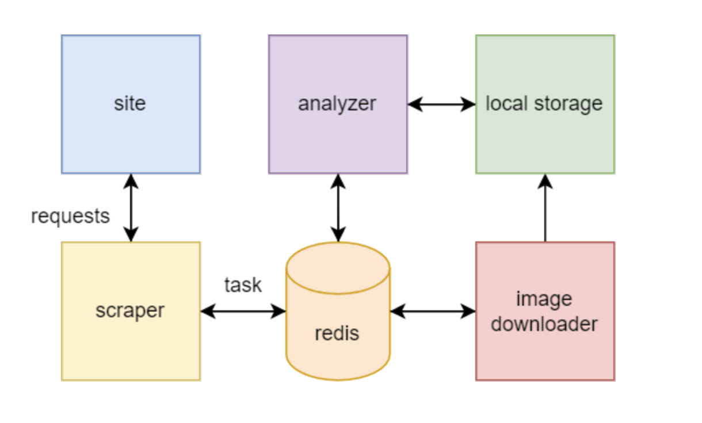

### **Project Objective**
1. You need to give the client 4 values: how many unique ads are on each link (links are given below).
2. There are identical ads on the site, and they need to be filtered out. The only way to compare if they match, the ads have the same pictures.
3. In the case of scraping, if there are identical ads (same pictures), then the second ad with the same pictures we do not count as unique.
4. If there is more than one picture in add, we will only compare the main one on the first page.
5. If the ad does not have any pictures, we count it as a real ad, not a duplicate.

* [Villa for sale in Riyadh](https://sa.aqar.fm/فلل-للبيع/الرياض)
* [Villa for sale in jeddah](https://sa.aqar.fm/فلل-للبيع/جدة)
* [Land for sale in Riyadh](https://sa.aqar.fm/أراضي-للبيع/الرياض)
* [Land for sale in Jeddah](https://sa.aqar.fm/أراضي-للبيع/جدة)

### **Used libs** 
* celery
* fiftyone
* redis
* requests

### **Project architecture**

